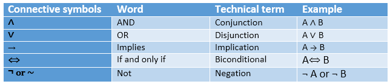
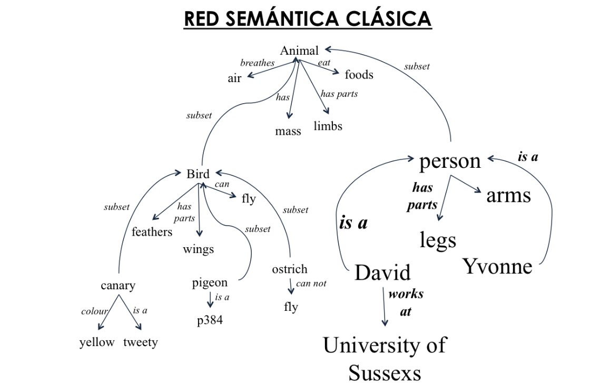
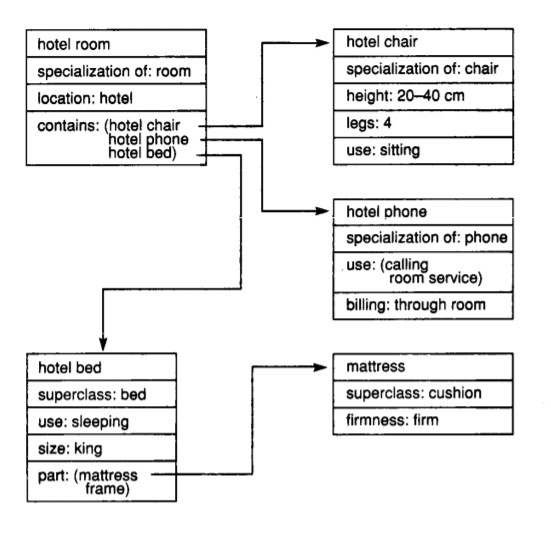
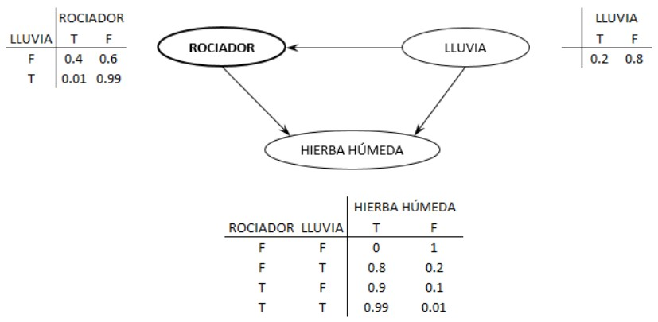

# Entrega Teórica
# Representación del conocimiento en el campo de la IA
### Curso 19/20
### Representación del Conocimiento
### Por Ricardo Manuel Ruiz Díaz

## Introducción
En esta entrega, hablaremos de las técnicas más utilizadas de la Representación del conocimiento en el campo de la Inteligencia Artificial, pero antes, primero deberemos dar una pequeña definición sobre a que nos referimos con Representación del Conocimiento. Una vez aclaremos esta duda entraremos en los siguientes campos :
-	Representación Lógica
-	Redes Semánticas
-	Representación de Marcos
-	Producción de Reglas
-	Redes Bayesianas.

## Representación del Conocimiento
La Representación del Conocimiento en IA, no sólo trata de almacenar datos en una base de datos, sino que representa información del mundo real para que una computadora la entienda, y luego utilice este conocimiento para resolver problemas de la vida real.
Formalmente la definimos como un área cuyo objetivo fundamental es representar el conocimiento de una manera que facilite la inferencia ( sacar conclusiones ) a partir de dicho conocimiento.
Debemos tener en cuenta que la inferencia se realiza sobre conocimiento incompleto o incierto ( aproximado o con incertidumbre).

## Representación Lógica
La representación lógica es un lenguaje con algunas reglas concretas que trata con proposiciones y no tiene ambigüedad en la representación. Representación lógica significa sacar una conclusión basada en varias condiciones.
Esta representación establece algunas reglas de comunicación importantes. Consiste en una sintaxis y una semántica definidas con precisión que admiten la inferencia de sonido. Cada oración se puede traducir a la lógica usando sintaxis y semántica.
-	Sintaxis:
        La sintaxis son las reglas que deciden cómo podemos construir oraciones legales en la lógica.
        Determina qué símbolo podemos usar en la representación del conocimiento.

-	Semántica:
        La semántica son reglas por las cuales podemos interpretar la oración en la lógica.
        También implica asignar un significado a cada oración.

La representación lógica se puede clasificar principalmente en dos lógicas:

-       Lógica Proposicional:
        Es la forma más simple de la lógica donde todas las declaraciones se hacen proposiciones. Una proposición es una declaración declarativa que es verdad o falsa.

        A continuación mostramos la tabla resumida para las conexiones lógicas proposicionales:

<p align="center">
        
</p>

        Ejemplo

 ```
        P: Hoy es martes
        ~P: Hoy no es martes
 ```     


-       Lógica de predicados:
        Es un sistema formal diseñado para estudiar la inferencia en los lenguajes de primer orden, que a su vez, son lenguajes formales con cuantificadores que alcanzan solo a variables de individuo, y con predicados y funciones cuyos argumentos son solo constantes o variables de individuo. Un ejemplo de aplicación de esta lógica es el algoritmo FOL.

        Ejemplo
```
        Todo hombre respeta a sus padres.
        En esta pregunta, el predicado es " respeto (x, y)", donde x = hombre ey = padre .
        Como hay todos los hombres, usará ∀, y se representará de la siguiente manera:
              ∀x man (x) → respeta (x, padre) .
```

### Ventajas
La representación lógica nos permite hacer razonamientos lógicos.
Es la base de los lenguajes de programación.

### Desventajas
Tiene algunas restricciones y son difíciles de trabajar.
La técnica puede no ser muy natural, y la inferencia puede no ser tan eficiente.

## Redes Semánticas
La técnica de Redes Semánticas Naturales se representa como grafos y consiste en solicitar a un grupo de sujetos que definan una serie de conceptos dados, empleando únicamente sustantivos, adjetivos, verbos o adverbios, evitando cualquier tipo de partícula gramatical. Posteriormente con las listas individuales de conceptos definidores obtenidas en cada grupo, es posible realizar un análisis cuantitativo que permite conocer las características de las Redes Semánticas Naturales obtenidas tanto grupal como individualmente. 
Son alternativas de la lógica de predicados. Podemos representar nuestro conocimiento en forma de redes gráficas. Esta red consta de nodos que representan objetos y arcos que describen la relación entre esos objetos 

A continuación mostraremos un ejemplo de una red semántica clásica:

<p align="center">
        
</p>

### Ventajas
Son una representación natural del conocimiento.
Transmiten significado de manera transparente.
Son simples y fácilmente comprensibles.

### Desventajas
Las redes semánticas toman más tiempo computacional en tiempo de ejecución.
Intentan modelar una memoria similar a la humana, por lo que no es posible construir una red semántica tan grande.
Este tipo de representaciones son inadecuadas ya que no tienen un cuantificador equivalente.
Las redes semánticas no tienen ninguna definición estándar para nombres de los enlaces.
No son inteligentes dependen del creador.

## Representación de Marcos
Se define como Marco, una colección de atributos que define el estado de un objeto y su relación con otros marcos, es decir, con otros objetos.
Al encontrar una situación nueva, seleccionar de memoria un marco y adaptarlo a la realidad cambiando detalles.
Los marcos pueden ser:
-	Clases, que representan conceptos o entidades generales.
-	Instancias, que son ejemplos particulares de las clases.
Los marcos se organizan jerárquicamente, dando lugar a un sistema de inferencia basado en herencia.

En esta imágen mostramos un ejemplo de una representación de Marcos:

<p align="center">
        
</p>

### Ventajas
Facilita la programación al agrupar los datos relacionados.
Es flexible y utilizada por muchas aplicaciones en IA.
Es muy fácil agregar espacios para nuevos atributos y relaciones.
Es fácil incluir datos predeterminados y buscar valores perdidos.
Es fácil de entender y visualizar.

### Desventajas
El mecanismo de inferencia no se procesa fácilmente.
El mecanismo de inferencia no puede proceder sin problemas mediante la representación de trama.
La representación de trama tiene un enfoque muy generalizado.

## Producción de Reglas
Siguen la siguiente forma:
si antecedente entonces consecuente, donde el antecedente es el conjunto de condiciones que se debe satisfacer en el dominio de aplicación para evaluar la regla y el consecuente es el conjunto de conclusiones o acciones que se derivan del antecedente.
Dado que cada regla puede verse como una unidad dentro de una base de conocimiento, es posible incorporar nuevo conocimiento o modificar el existente creando o cambiando las reglas individualmente.
Varias reglas pueden activarse al mismo tiempo, por lo que se hacen necesarias estrategias de control para decidir qué regla disparar o en qué orden hacerlo.

Ejemplo:

```
        si temperatura=40 entonces fiebre=presente
```

### Ventajas
Se expresan en lenguaje natural.
Son altamente modulares, por lo que podemos eliminar, agregar, o modificar fácilmente una regla individual.

### Desventajas
No exhibe ninguna capacidad de aprendizaje, ya que no almacena el resultado del problema para usos futuros.
Necesidad de una estrategia de control de reglas.

## Redes Bayesianas
Las redes bayesianas son sistemas expertos que representan el conocimiento incierto mediante probabilidades.
Son grafos dirigidos acíclicos cuyos nodos representan variables aleatorias en el sentido de Bayes, las aristas representan dependencias condicionales.
Cada nodo tiene asociado una función de probabilidad que toma como entrada un conjunto particular de valores padres del nodo y devuelve la probabilidad de la variable representada en el nodo.

En el siguiente ejemplo podremos ver el funcionamiento de una red bayesiana

```
        Supongamos que hay dos eventos los cuales pueden causar que la hierba esté húmeda: que el rociador esté activado o que esté lloviendo. También supongamos que la lluvia tiene un efecto directo sobre el uso del rociador (usualmente cuando llueve el rociador se encuentra apagado). Las tres variables tienen dos posibles valores, T (para verdadero) y F (para falso).

```

<p align="center">
        
</p>

### Ventajas
La posibilidad de combinar datos objetivos y subjetivos.
Pueden modelar sistemas complejos.
Puede actualizarse rápidamente o modificarse por cambios en la información.
Puede utilizarse para análisis de “Que pasa si”.

### Desventajas
La confiabilidad de la información a priori ( Una expectativa demasiado optimista o pesimista a priori pueden distorsionar la red ).
Pueden generarse muchos arcos “innecesarios”.

## Bibliografía
¿Qué es la representación del conocimiento en IA? -> Edureka.co
-   https://www.edureka.co/blog/knowledge-representation-in-ai/

Representación del conocimiento en Inteligencia Artificial 
-   https://www.slideshare.net/YasirAhmedKhan/5-knowledgerepresentation-10-sldes

Representación del Conocimiento
-   https://es.wikipedia.org/wiki/Representaci%C3%B3n_del_conocimiento

Representación del conocimiento mediante lógica formal 
-   https://www.nebrija.es/~cmalagon/ia/transparencias/representacion_del_conocimiento_prolog.pdf 

Lógica proposicional
-   https://www.javatpoint.com/propositional-logic-in-artificial-intelligence

Lógica de predicados
-   https://es.wikipedia.org/wiki/L%C3%B3gica_de_primer_orden

Ejemplo de lógica de predicados:
-   https://www.javatpoint.com/first-order-logic-in-artificial-intelligence

Técnicas de representación del conocimiento
-   https://www.javatpoint.com/ai-techniques-of-knowledge-representation

Redes semánticas
-   https://es.wikipedia.org/wiki/Redes_sem%C3%A1nticas_naturales

Inteligencia Artificial
-   https://www.uv.mx/personal/edbenitez/files/2010/11/CursoIA10-III-4.pdf

Inteligencia Artificial, Redes Bayesianas
-   https://www.cs.us.es/cursos/iais-2015/temas/tema-05.pdf 

Tesis, Riesgo operacional en el mercado del dinero
-   https://tesis.ipn.mx/bitstream/handle/123456789/10548/91.pdf?sequence=1&isAllowed=y

Red bayesiana
-   https://es.wikipedia.org/wiki/Red_bayesiana

